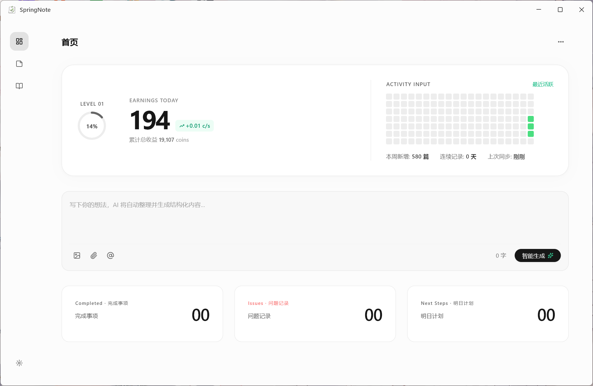

<h1 align="center">
  
  SpringNote
</h1>

 

SpringNote 是一款面向桌面的 AI 智能便签与个人记忆管理应用。它把快速记录、AI 整理、日报/周报/月报、回忆书对话、统计分析和本地个性化设置放在同一个轻量工作台里，让日常想法、工作记录和长期知识沉淀自然流动。

## ✨ 核心功能

SpringNote 旨在打造极致流畅的轻量工作台：

1. **🧠 首页工作台**：独创等级、收益、活跃热力图、快速输入框和今日摘要卡片。
2. **⚡ AI 智能生成**：在首页快速输入想法，由 AI 自动整理为结构化内容。
3. **📝 便签编辑**：支持日报、周报、月报等记录类型，提供 Markdown 编辑、预览、代码块高亮和 AI 补全预测。
4. **💬 回忆书对话**：以对话方式检索和整理记忆内容，支持思考过程、工具调用展示与 Markdown 渲染。
5. **📊 自动报告生成**：启动时可按日期补齐缺失的周报/月报，基于已有日报或周报生成总结。
6. **📈 统计面板**：查看记录、活跃度、模型调用和时间范围内的数据概览。
7. **⚙️ 桌面端极致体验**：支持自定义 Windows 标题栏、托盘、开机自启动、全局快捷键、桌面状态组件和系统字体切换。

## ⭐ Star History

> [!TIP]
> 如果本项目对您的生活 / 工作产生了帮助，或者您关注本项目的未来发展，请给项目 Star，这是我们维护这个开源项目的动力 <3
 

  

 

